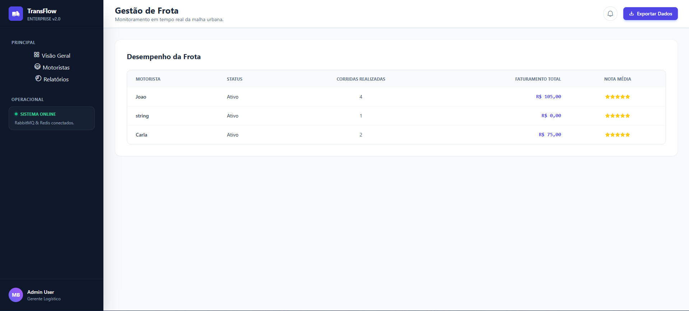
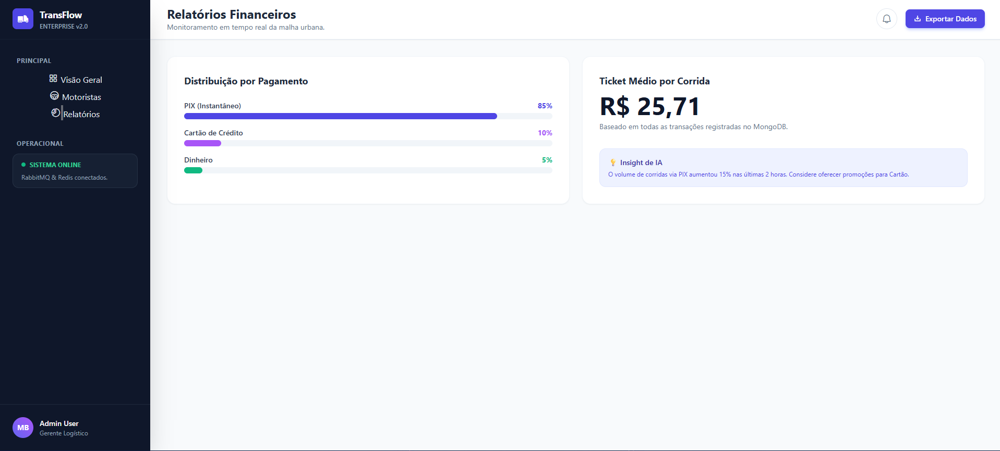
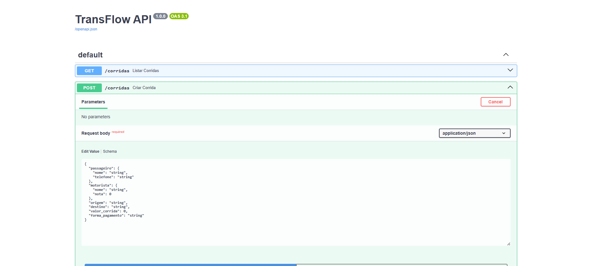
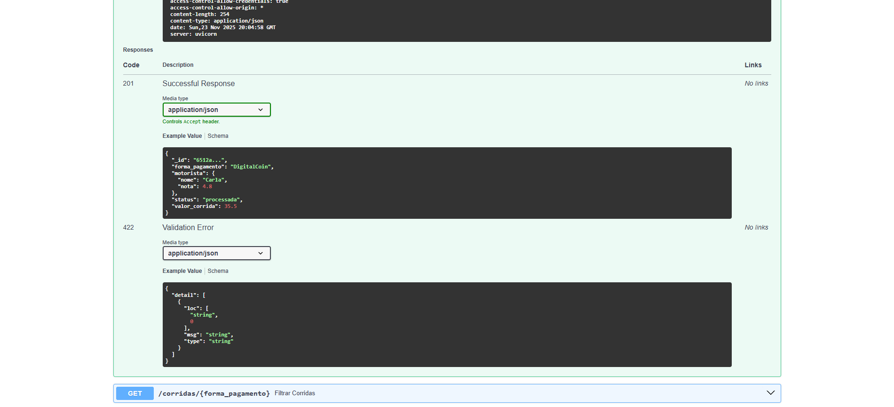
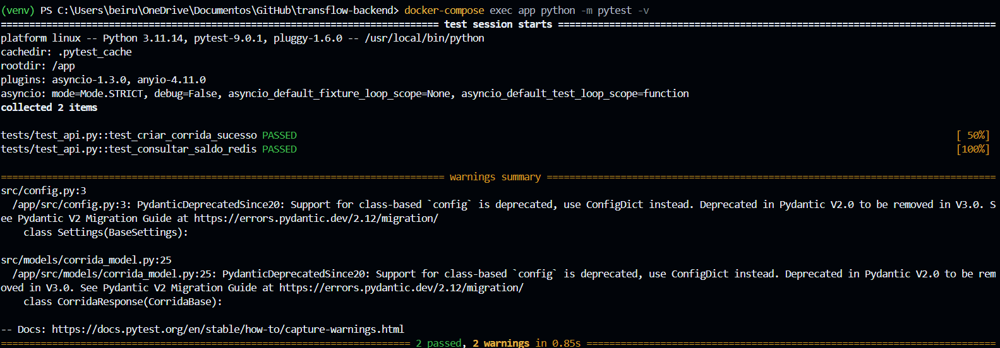

<p align="center">
  
</p>

<h3 align="center">
  Universidade de Vassouras  
</h3>

---

### 📚 Curso: **Engenharia de Software** 
### 🖥️ Disciplina: **Banco de Dados Não Relacionais** 
### 👨‍🎓 Autor: **Matheus Beiruth**

---


# 🚖 TransFlow API

> Backend de alta performance para gestão de corridas urbanas com processamento assíncrono, arquitetura de microsserviços e Frontend Enterprise.

Este projeto simula um ecossistema completo de mobilidade urbana (semelhante a Uber/99), onde a alta concorrência de transações e a consistência de dados são tratadas utilizando mensageria (RabbitMQ), cache distribuído (Redis) e persistência NoSQL (MongoDB).

---

## 🖥️ Interface do Usuário (Frontend SPA)

O sistema conta com um **Dashboard Enterprise** desenvolvido com HTML5, TailwindCSS e JavaScript Puro, operando como uma Single Page Application (SPA) para monitoramento em tempo real.

### 1. Painel de Controle (Visão Geral)
Monitoramento de KPIs, solicitação de corridas e feed de transações em tempo real via WebSocket/Polling.


### 2. Gestão de Frota (Motoristas)
Algoritmo no Frontend processa os dados brutos da API para gerar métricas de desempenho individual dos motoristas.


### 3. Analytics Financeiro (Relatórios)
Análise de distribuição de pagamentos e cálculo de Ticket Médio da operação.


---

## 🔌 Backend & API (FastAPI)

A API foi construída focando em performance e documentação automática (OpenAPI 3.1).

### Documentação Interativa (Swagger UI)
Todos os endpoints são documentados e testáveis via navegador.


### Modelagem de Dados (Schemas Pydantic)
Validação rigorosa de tipos de dados na entrada (Request) e saída (Response) para garantir integridade.


---

## 🧪 Qualidade de Código (QA)

O projeto possui uma suíte de testes automatizada utilizando `pytest` e `TestContainers` (mocks), garantindo que a lógica de negócios funcione isoladamente da infraestrutura.

### Execução dos Testes


---

## 🚀 Tecnologias Utilizadas

* **Linguagem:** Python 3.11
* **Web Framework:** FastAPI (Alta performance)
* **Mensageria:** RabbitMQ + FastStream (Processamento Assíncrono)
* **Banco de Dados:** MongoDB (Persistência de Corridas)
* **Cache & Sessão:** Redis (Gestão de Saldo Atômica)
* **Infraestrutura:** Docker & Docker Compose
* **Frontend:** Nginx Server (SPA)

---

## ⚙️ Arquitetura da Solução

O sistema resolve o problema de **concorrência de saldo** (Race Conditions) utilizando um fluxo orientado a eventos:

1.  **API Gateway:** Recebe `POST /corridas`, salva como `pendente` no Mongo e retorna `201 Created`.
2.  **Producer:** Publica evento na fila `corridas_queue` (RabbitMQ).
3.  **Worker:**
    * Consome a fila assincronamente.
    * Executa `INCRBYFLOAT` no **Redis** (Operação Atômica).
    * Atualiza status para `processada` no **MongoDB**.

---

## 📂 Estrutura do Projeto

```bash
transflow-backend/
├── assets/                  # Evidências (Prints)
│   ├── backend_post.png
│   ├── post.png
│   ├── front1.png
│   ├── front2.png
│   ├── front3.png
│   └── pytest.png
├── frontend/                # Aplicação Web (SPA)
│   ├── Dockerfile           # Configuração Nginx
│   ├── index.html           # Estrutura HTML
│   ├── script.js            # Lógica (API + Gráficos)
│   └── styles.css           # Estilos e Animações
├── src/                     # Código Fonte Backend
│   ├── database/            # Camada de Persistência
│   │   ├── mongo_client.py  # Driver Motor (MongoDB)
│   │   └── redis_client.py  # Driver Redis (Cache)
│   ├── models/              # Camada de Dados
│   │   └── corrida_model.py # Schemas Pydantic (Validação)              # Schemas Pydantic
│   ├── config.py            # Configurações Gerais
│   ├── consumer.py          # Worker RabbitMQ
│   ├── main.py              # API Server
│   └── producer.py          # Publicador de Eventos
├── tests/                   # Testes Automatizados
│   └── test_api.py
├── .env                     # Variáveis de Ambiente
├── docker-compose.yml       # Orquestração de Containers
├── Dockerfile               # Imagem do Backend
├── README.md                # Documentação Oficial
└── requirements.txt         # Dependências Python
```

## 🛠️ Como Executar

### Pré-requisitos
* Docker e Docker Compose instalados.

### Passo a Passo

1.  **Clone o repositório:**
    ```bash
    git clone [https://github.com/BeiruthDEV/transflow-backend.git](https://github.com/BeiruthDEV/transflow-backend.git)
    cd transflow-backend
    ```

2.  **Suba o ambiente:**
    ```bash
    docker-compose up --build
    ```

3.  **Acesse:**
    * **Dashboard:** [http://localhost](http://localhost)
    * **API Docs:** [http://localhost:8000/docs](http://localhost:8000/docs)

---

## 🧪 Rodando os Testes

Para validar a aplicação dentro do container:

```bash
docker-compose exec app python -m pytest -v